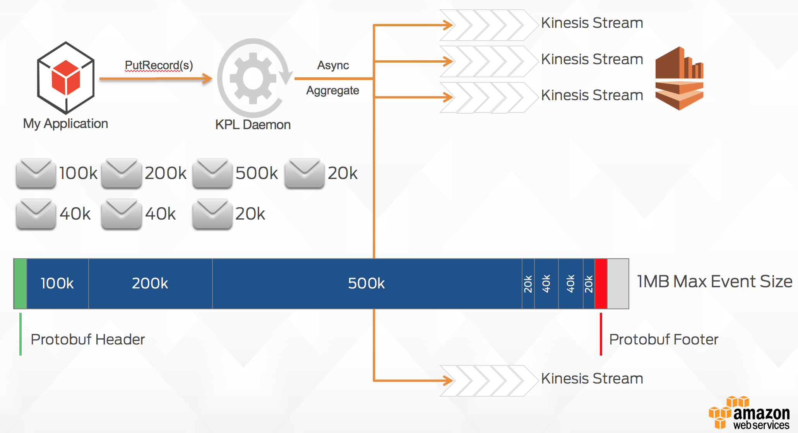
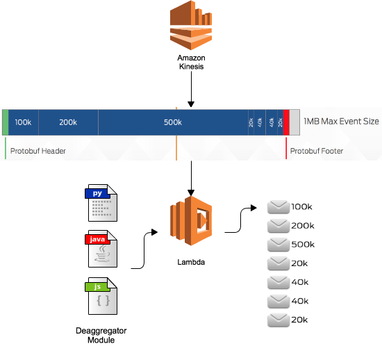

# Kinesis Producer Library Deaggregation Modules for AWS Lambda

The [Amazon Kinesis Producer Library (KPL)](http://docs.aws.amazon.com/kinesis/latest/dev/developing-producers-with-kpl.html) gives you the ability to write data to Amazon Kinesis with a highly efficient, asyncronous delivery model that can [improve performance](http://docs.aws.amazon.com/kinesis/latest/dev/developing-producers-with-kpl.html#d0e4909). When you write to the Producer, you can take advantage of Message Aggregation, which writes multiple producer events to a single Kinesis Record, aggregating lots of smaller events into a 1MB record. When you use Aggregation, the KPL serialises data to the Kinesis stream using [Google Protocol Buffers](https://developers.google.com/protocol-buffers), and consumer applications must be able to deserialise this protobuf message. 

The components in this project give you the ability to process KPL serialised data within AWS Lambda, in Java, Node.js and Python. These components can also be used as part of the Kinesis Client Library a [multi-lang KCL application](https://github.com/awslabs/amazon-kinesis-client/blob/master/src/main/java/com/amazonaws/services/kinesis/multilang/package-info.java). The [Java KCL](https://github.com/awslabs/amazon-kinesis-client) also provides the ability to automatically deaggregate and process KPL encoded data, and in this project we give you a version that performs the same function for AWS Lambda.

### Language Specific Implementations

AWS Lambda supports Java, Node.js and Python as programming languages. We have included support for those languages so that you can process UserRecords via a standalone KPL-Deaggregator module. Documentation is provided for each language:

| Language | Location |
:--- | :--- 
| Java | [java](java/) |
| Node.js Javascript | [node.js](node/) |
| Python | [python](python/) |

----

Copyright 2014-2015 Amazon.com, Inc. or its affiliates. All Rights Reserved.

Licensed under the Amazon Software License (the "License"). You may not use this file except in compliance with the License. A copy of the License is located at

	http://aws.amazon.com/asl/

or in the "license" file accompanying this file. This file is distributed on an "AS IS" BASIS, WITHOUT WARRANTIES OR CONDITIONS OF ANY KIND, express or implied. See the License for the specific language governing permissions and limitations under the License.